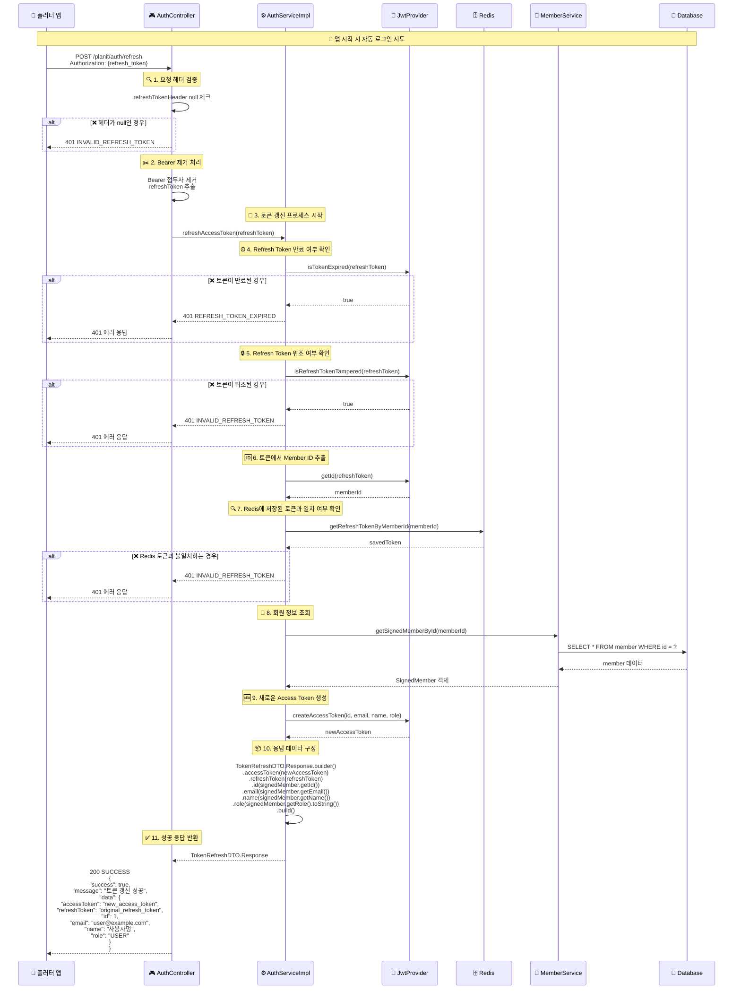
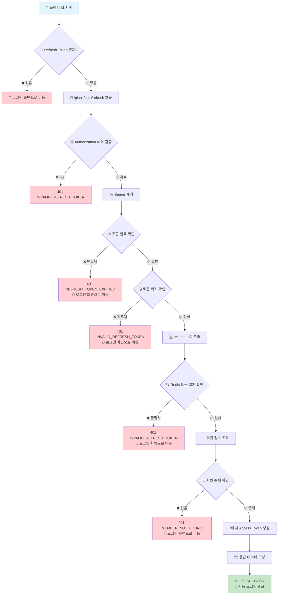
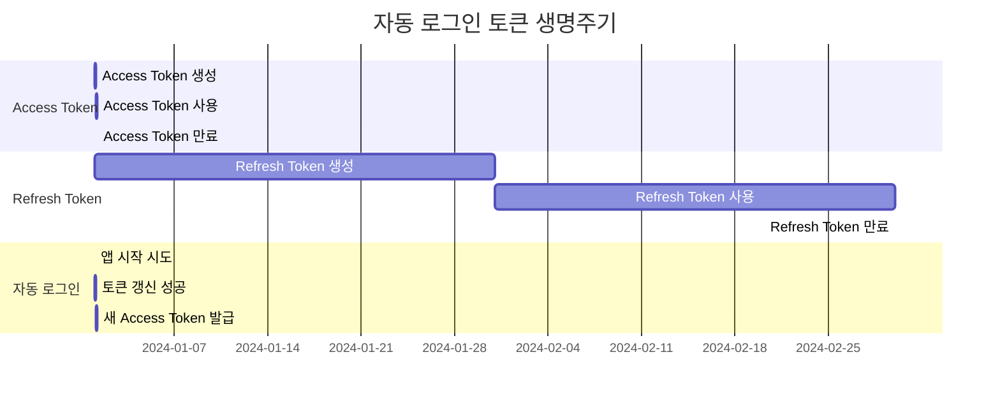

# 자동 로그인 API 호출 흐름도

## 개요
플래닛 서버의 자동 로그인은 Refresh Token을 사용하여 새로운 Access Token을 발급받는 방식으로 동작합니다.

## API 엔드포인트
```
POST /planit/auth/refresh
```

## 요청 헤더
```
Authorization: Bearer {refresh_token}
```

## 전체 흐름도



## 에러 케이스별 흐름도



## 토큰 생명주기 다이어그램



## 상세 프로세스 설명

### 1. 앱 시작 시 자동 로그인
- 플러터 앱이 시작될 때 저장된 Refresh Token을 사용하여 자동 로그인을 시도합니다.
- Refresh Token은 30일간 유효하며, 이 기간 동안 자동 로그인이 가능합니다.

### 2. 요청 헤더 검증
- `Authorization` 헤더가 존재하는지 확인합니다.
- 헤더가 null인 경우 `INVALID_REFRESH_TOKEN` 에러를 반환합니다.

### 3. Bearer 제거 처리
- `Bearer ` 접두사가 있으면 제거하고, 없으면 그대로 사용합니다.
- 두 가지 방식 모두 지원하여 클라이언트 구현의 유연성을 제공합니다.

### 4. Refresh Token 검증
- **만료 여부 확인**: JWT의 만료 시간을 확인하여 토큰이 만료되었는지 검증합니다.
- **위조 여부 확인**: 토큰의 서명을 검증하여 위조되지 않았는지 확인합니다.

### 5. Redis 토큰 일치 확인
- 토큰에서 추출한 Member ID를 사용하여 Redis에 저장된 Refresh Token과 일치하는지 확인합니다.
- 이는 토큰 재사용 공격을 방지하는 보안 메커니즘입니다.

### 6. 회원 정보 조회
- Member ID를 사용하여 데이터베이스에서 회원 정보를 조회합니다.
- 회원이 존재하지 않는 경우 에러를 반환합니다.

### 7. 새로운 Access Token 생성
- 회원 정보를 바탕으로 새로운 Access Token을 생성합니다.
- Access Token의 유효기간은 2시간입니다.

### 8. 응답 반환
- 새로운 Access Token과 기존 Refresh Token, 회원 정보를 포함한 응답을 반환합니다.
- Refresh Token은 만료될 때까지 재사용됩니다.

## 에러 케이스

### 1. Refresh Token 만료
```json
{
  "success": false,
  "message": "Refresh Token이 만료되었습니다",
  "errorCode": "REFRESH_TOKEN_EXPIRED"
}
```

### 2. Refresh Token 위조
```json
{
  "success": false,
  "message": "유효하지 않은 Refresh Token입니다",
  "errorCode": "INVALID_REFRESH_TOKEN"
}
```

### 3. Redis 토큰 불일치
```json
{
  "success": false,
  "message": "유효하지 않은 Refresh Token입니다",
  "errorCode": "INVALID_REFRESH_TOKEN"
}
```

## 보안 고려사항

1. **토큰 만료 시간**: Refresh Token은 30일, Access Token은 2시간으로 설정되어 있습니다.
2. **Redis 저장**: Refresh Token은 Redis에 저장되어 토큰 재사용 공격을 방지합니다.
3. **서명 검증**: JWT 서명을 검증하여 토큰 위조를 방지합니다.
4. **블랙리스트**: 로그아웃 시 Access Token을 블랙리스트에 추가합니다.

## 성능 최적화

1. **Redis 캐싱**: Refresh Token을 Redis에 저장하여 빠른 조회가 가능합니다.
2. **로그 레벨**: 상세한 로그를 통해 디버깅과 모니터링을 지원합니다.
3. **에러 처리**: 각 단계별로 적절한 에러 처리를 통해 안정성을 보장합니다. 