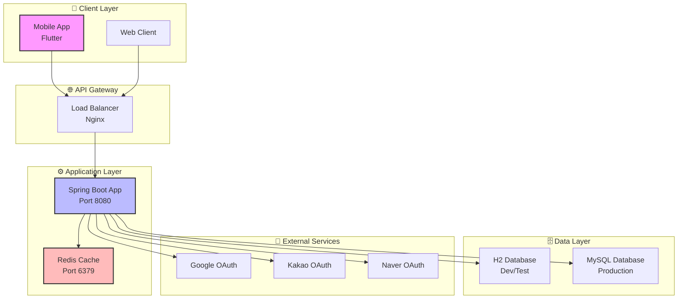
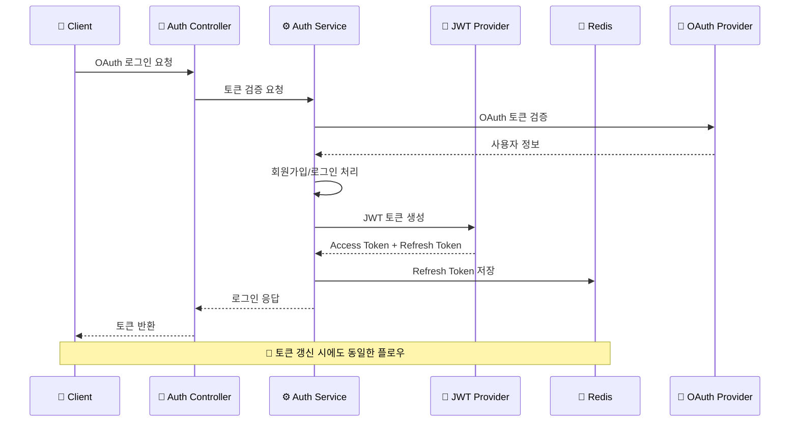

# 🚀 Planit - Spring Boot 백엔드 서버

<div align="center">


**모바일 앱을 위한 Spring Boot 백엔드 서버**  
*OAuth 인증, JWT 토큰 관리, Redis 캐싱을 통한 API 서버*

[📖 API 문서](#-api-문서) • [🚀 빠른 시작](#-빠른-시작) • [🏗️ 아키텍처](#️-시스템-아키텍처)

</div>

---

## ✨ 주요 기능

- 🔐 **OAuth 2.0 인증** (Google, Kakao, Naver)
- 🎫 **JWT 토큰 관리** (Access Token + Refresh Token)
- 💾 **Redis 캐싱** (토큰 저장 및 성능 최적화)
- 📱 **RESTful API** (모바일 앱 연동)
- 🗄️ **다중 데이터베이스** (H2 개발, MySQL 운영)
- 🐳 **Docker 컨테이너화** (일관된 실행 환경)
- 📚 **Swagger API 문서** (자동 생성)
- ⏰ **한국 시간대 설정** (Asia/Seoul)

## 📋 목차
- [기술 스택](#-기술-스택)
- [시스템 아키텍처](#-시스템-아키텍처)
- [환경 구성](#-환경-구성)
- [빠른 시작](#-빠른-시작)
- [실행 방법](#-실행-방법)
- [API 문서](#-api-문서)
- [테스트 실행](#-테스트-실행)
- [시간대 설정](#-시간대-설정)
- [Git 설정 주의사항](#-git-설정-주의사항)

---

## 🛠️ 기술 스택

<div align="center">

| 분류 | 기술 | 버전 |
|------|------|------|
| **Backend** | Java, Spring Boot | 17, 3.2.4 |
| **Database** | H2, MySQL | In-Memory, 8.0 |
| **Cache** | Redis | 7.0 |
| **Security** | Spring Security, JWT | - |
| **OAuth** | Google, Kakao, Naver | - |
| **Documentation** | SpringDoc OpenAPI | 2.3.0 |
| **Container** | Docker, Docker Compose | - |
| **Build** | Gradle | 8.6 |
| **Testing** | JUnit 5, Spring Boot Test | - |

</div>

---

## 🏗️ 시스템 아키텍처

<div align="center">

### 전체 시스템 구조



</div>

### OAuth 인증 플로우



</div>

## 📁 환경 구성

<div align="center">

| 환경 | 설명 | 데이터베이스 | 용도 |
|------|------|-------------|------|
| 🧪 **dev** | 개발용, 빠른 테스트용 | H2 (In-Memory) | 로컬 개발 |
| 🚀 **prod** | 운영 배포용 | MySQL | 실제 서비스 |
| 🧪 **test** | 테스트 자동화/TDD용 | H2 (create-drop) | 단위 테스트 |

</div>

---

## ⚡ 빠른 시작

<div align="center">

### 🚀 3단계로 서버 실행하기

</div>

### 1️⃣ 저장소 클론
```bash
git clone https://github.com/PLANlT/planit-server.git
cd planit-server
```

### 2️⃣ 도커로 실행
```bash
# 개발 환경 실행 (H2 + Redis)
docker-compose up --build -d

# 서버 상태 확인
docker-compose ps

# 로그 확인
docker-compose logs -f app
```

### 3️⃣ 접속 확인
<div align="center">

| 서비스 | URL | 설명 |
|--------|-----|------|
| 🌐 **API 서버** | http://localhost:8080 | 메인 API 엔드포인트 |
| 📚 **Swagger UI** | http://localhost:8080/swagger-ui/index.html | API 문서 |
| 🗄️ **H2 콘솔** | http://localhost:8080/h2-console | 데이터베이스 관리 |
| 💾 **Redis** | localhost:6379 | 캐시 서버 |

</div>

---

## 🚀 실행 방법

### 1. `.env` 파일 생성

아래 예시를 참고하여 `.env.dev`, `.env.prod`, `.env.test` 파일을 **루트 디렉토리에 생성**합니다.

> ⚠️ **보안 주의:** 실제 계정/비밀번호가 포함된 `.env.prod`는 Git에 절대 커밋하지 말고, `.gitignore`에 반드시 포함시키세요.

<details>
<summary>📄 .env.dev (예시)</summary>

```
SPRING_PROFILES_ACTIVE=dev
```

</details>

<details>
<summary>📄 .env.prod (예시 - 실제 비밀번호 절대 커밋 금지)</summary>

```
SPRING_PROFILES_ACTIVE=prod

SPRING_DATASOURCE_URL=jdbc:mysql://<prod-db-host>:3306/planit
SPRING_DATASOURCE_USERNAME=<prod_user>
SPRING_DATASOURCE_PASSWORD=<prod_password>

MYSQL_DATABASE=planit
MYSQL_ROOT_PASSWORD=<mysql_root_pw>
```

</details>

<details>
<summary>📄 .env.test (예시)</summary>

```
SPRING_PROFILES_ACTIVE=test
```

</details>

---

### 2. Docker 실행

```bash
# 개발 환경 (H2 기반)
docker-compose --env-file .env.dev up -d

# 운영 환경 (MySQL 기반)
docker-compose --env-file .env.prod up -d

# 테스트 환경 (TDD용 H2 + create-drop)
docker-compose --env-file .env.test up -d
```

### 컨테이너 종료

```bash
docker-compose down
```

---

## 📚 API 문서

<div align="center">

### 🔗 API 엔드포인트

| 카테고리 | 엔드포인트 | 설명 |
|----------|------------|------|
| 🔐 **인증** | `/planit/auth/*` | OAuth 로그인, 토큰 관리 |
| 👤 **회원** | `/planit/members/*` | 회원 정보, 프로필 관리 |
| 📋 **계획** | `/planit/plans/*` | 계획 생성, 수정, 조회 |
| ✅ **태스크** | `/planit/tasks/*` | 태스크 관리, 완료 처리 |
| 📄 **약관** | `/planit/terms/*` | 이용약관, 개인정보처리방침 |

### 📖 Swagger UI
- **URL**: http://localhost:8080/swagger-ui/index.html
- **OpenAPI JSON**: http://localhost:8080/v3/api-docs

</div>

---

## ⏰ 시간대 설정

### 로컬 개발 환경
```yaml
# docker-compose.yml
volumes:
  - /etc/localtime:/etc/localtime:ro
environment:
  - TZ=Asia/Seoul
```

### 배포 환경
```dockerfile
# Dockerfile
ENV TZ=Asia/Seoul
RUN ln -snf /usr/share/zoneinfo/$TZ /etc/localtime && echo $TZ > /etc/timezone
```

### Java 애플리케이션
```java
@PostConstruct
void started() {
    TimeZone.setDefault(TimeZone.getTimeZone("Asia/Seoul"));
}
```

---

## 🧪 테스트 실행

### 도커 환경에서 테스트
```bash
# 테스트 실행 (테스트 제외하고 빌드)
./gradlew build -x test

# 테스트만 실행
./gradlew test

# 테스트 커버리지 확인
./gradlew jacocoTestReport
```

### 로컬 JUnit 기준

### 방법 1: VM 옵션 지정

```
-Dspring.profiles.active=test
```

### 방법 2: 테스트 클래스에 직접 지정

```java
@ActiveProfiles("test")
@SpringBootTest
class SomeServiceTest {
 
}
```

### 방법 3: Gradle 설정에 추가

`build.gradle`에 다음 추가:

```groovy
test {
    useJUnitPlatform()
    systemProperty "spring.profiles.active", "test"
}
```

---


## 📌 Git 설정 주의사항

`.gitignore`에 다음 항목을 추가해 주세요:

```
.env.dev
.env.prod
.env.test
```

---

## 📊 프로젝트 상태

<div align="center">


</div>

---

## 🤝 기여하기

<div align="center">

### 💡 프로젝트에 기여하고 싶으신가요?

</div>

1. **Fork the Project** 🍴
2. **Create your Feature Branch** (`git checkout -b feature/AmazingFeature`)
3. **Commit your Changes** (`git commit -m 'Add some AmazingFeature'`)
4. **Push to the Branch** (`git push origin feature/AmazingFeature`)
5. **Open a Pull Request** 📝

---

## 📄 라이선스

<div align="center">

이 프로젝트는 **MIT 라이선스** 하에 배포됩니다.  
자세한 내용은 `LICENSE` 파일을 참조하세요.

</div>

---

<div align="center">

### 🚀 **Planit 백엔드 서버**

*Spring Boot로 만든 모바일 앱 백엔드 서버*

**⭐ Star를 눌러주세요!**

</div>
